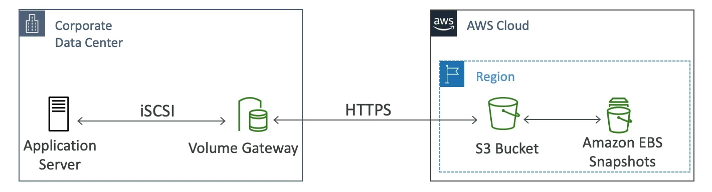

# Volume Gateway

Amazon Volume Gateway provides cloud-backed storage solutions, offering seamless integration between on-premises environments and AWS cloud storage services through the iSCSI protocol.

## Key Features

- **Block Storage via iSCSI**: Leverages the iSCSI protocol to provide block storage that integrates with on-premises applications.

- **EBS Snapshots Backup**: Utilizes Amazon EBS snapshots for backing up on-premises volumes, facilitating easy restoration.

- **Cached Volumes**: Offers low latency access to the most recently accessed data, while storing the full dataset in Amazon S3.

- **Stored Volumes**: Keeps the entire dataset on-premises, with scheduled backups to Amazon S3, ensuring data durability and business continuity.

By employing Volume Gateway, businesses can achieve a hybrid storage environment that combines the flexibility of cloud storage with the performance and familiarity of on-premises systems.

