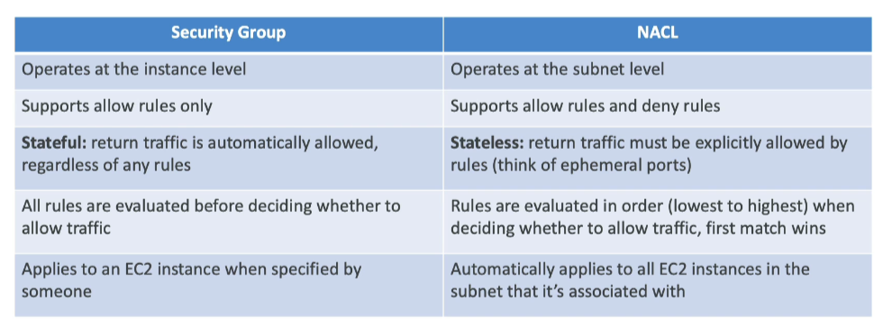

# Network ACL (NACL)

- **Purpose**: NACLs are like a firewall which control traffic from and to subnets.
- **Assignment**: One NACL per subnet, new subnets are assigned to the Default NACL.
- **NACL Rules**:
    - **Rule Number**: Rules have a number (1-32766), higher precedence with a lower number.
    - **First Match**: First rule match will drive the decision.
        - **Example**: If you define #100 ALLOW 10.0.0.10/32 and #200 DENY 10.0.0.10/32, the IP address will be allowed because it has a higher precedence over 200.
    - **Default Rule**: The last rule is an asterisk (\*) and denies a request in case of no rule match.
    - **Recommendation**: AWS recommends adding rules by increment of 100.
- **Default Behavior**: Newly created NACLs will deny everything.
- **Use Case**: NACLs are a great way of blocking a specific IP address at the subnet level.

