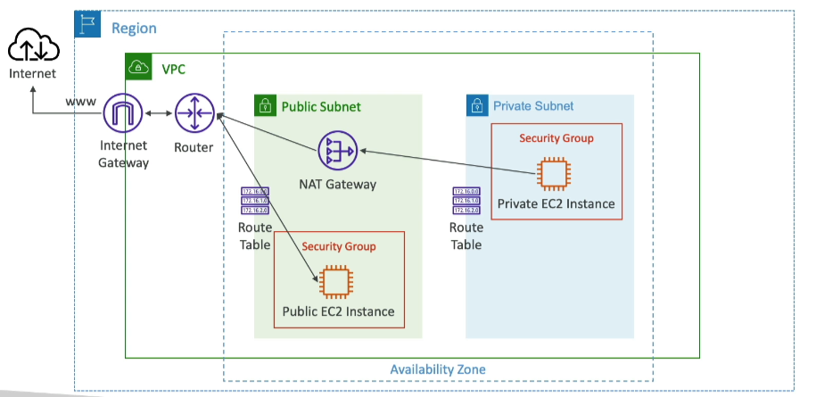
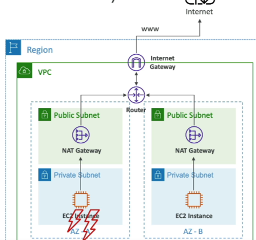
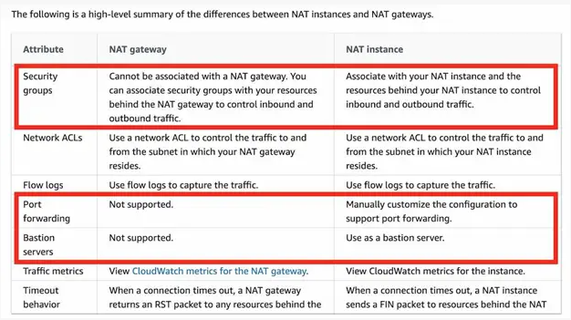

# NAT Gateway

- **AWS-managed NAT**: Higher bandwidth, high availability, no administration.
- **Cost**: Pay per hour for usage and bandwidth.
- **Elastic IP**: NATGW is created in a specific AZ, uses an Elastic IP.
- **Subnet Restrictions**: Can't be used by EC2 instances in the same subnet (only from other subnets).
- **Internet Gateway Requirement**: Requires an IGW (Private Subnet => NATGW => IGW).
- **Bandwidth**: 5 Gbps of bandwidth with automatic scaling up to 100 Gbps.
- **Security Groups**: No security groups to manage/required.

## NAT Gateway with High Availability

- **Resilience**: NAT Gateway is resilient within a single AZ.
- **Fault-Tolerance**: Must create multiple NAT Gateways in multiple AZs for fault-tolerance.
- **Cross-AZ Failover**: There is no cross-AZ failover needed because if an AZ goes down, it doesn't need NAT.

## NAT Gateway vs. NAT Instance

- **NAT Gateway**:
    - **Managed Service**: AWS manages NAT Gateway.
    - **High Availability**: Multi-AZ redundancy.
    - **Bandwidth**: 5 Gbps, auto-scales to 100 Gbps.
    - **No Administration**: No need to patch, manage, or monitor.
    - **Cost**: Pay per hour + data processed.
    - **Elastic IP**: Automatically assigned.
    - **Security Groups**: No need to manage.
- **NAT Instance**:
    - **EC2 Instance**: Must manage the EC2 instance.
    - **High Availability**: Need to create an ASG for multi-AZ.
    - **Bandwidth**: Depends on EC2 instance type.
    - **Administration**: Need to patch, manage, and monitor.
    - **Cost**: Pay per hour for EC2 instance + data processed.
    - **Elastic IP**: Must manually assign.
    - **Security Groups**: Must manage security groups.

