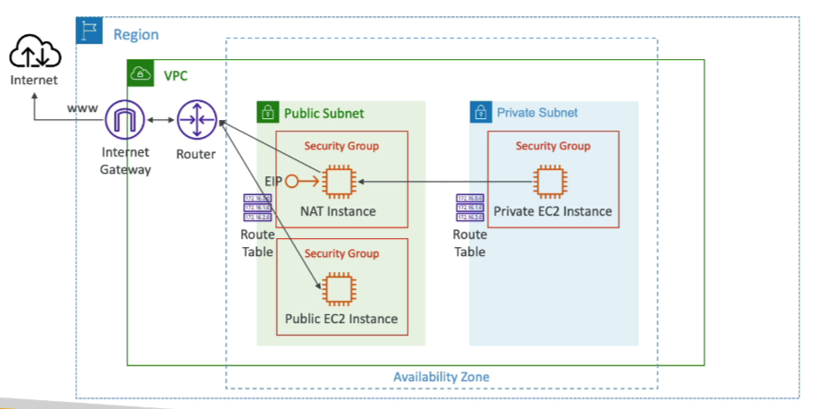

# NAT Instance

- **NAT = Network Address Translation**
- **Purpose**: Allows EC2 instances in private subnets to connect to the internet.
- **Public Subnet**: Must be launched in a public subnet.
- **Source/Destination Check**: Must disable EC2 setting: Source/Destination Check.
- **Elastic IP**: Must have Elastic IP attached to it.
- **Route Tables**: Must be configured to route traffic from private subnets to the NAT Instance.
- **Availability**: Not highly available/resilient setup out of the box.
    - **Solution**: Need to create an ASG in multi-AZ + resilient user-data script.
- **Bandwidth**: Internet traffic bandwidth depends on EC2 instance type.
- **Security Groups & Rules**: Must manage Security Groups & rules.
    - **Inbound**:
        - Allow HTTP/HTTPS traffic coming from Private Subnets.
        - Allow SSH from home network (access is provided through Internet Gateway).
    - **Outbound**:
        - Allow HTTP/HTTPS traffic to the internet.

