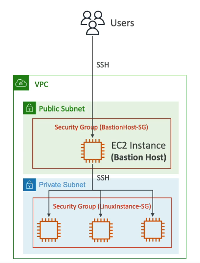

# Bastion Hosts

- **SSH Access**: Can use a Bastion Host to SSH into our private EC2 instances.
- **Public Subnet**: The bastion is in the public subnet which is then connected to all other private subnets.
- **Security Group for Bastion Host**: Must allow inbound from the internet on port 22 from restricted CIDR, for example, the public CIDR of your corporation.
- **Security Group for EC2 Instances**: Must allow the Security Group of the Bastion Host, or the private IP of the Bastion Host.

