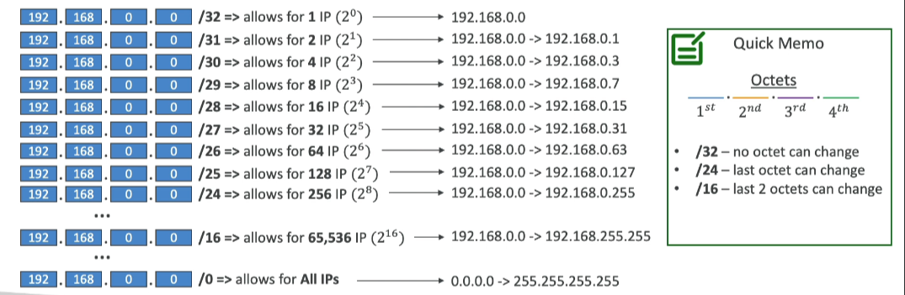

# CIDR - IPv4

**Classless Inter-Domain Routing** - a method for allocating IP addresses.

Used in Security Groups rules and AWS networking in general. They help to define an IP address range:
- **WW.XX.YY.ZZ/32**: One IP
- **0.0.0.0/0**: All IPs
- **192.168.0.0/26**: 192.168.0.0 - 192.168.0.63 (64 IP addresses)

## Components of a CIDR

### Base IP
Represents an IP contained in the range (XX.XX.XX.XX)
- Example: 10.0.0.0, 192.168.0.0, etc.

### Subnet Mask
Defines how many bits can change in the IP.
- Example: /0, /24, /32

Can take two forms:
- **/8**: 255.0.0.0
- **/16**: 255.255.0.0
- **/24**: 255.255.255.0
- **/32**: 255.255.255.255

The Subnet Mask allows part of the underlying IP to get additional next values from the base IP.

## Private and Public IP Addresses

The Internet Assigned Numbers Authority (IANA) established certain blocks of IPv4 addresses for the use of private (LAN) and public (Internet) addresses.

### Private IP Ranges
- **10.0.0.0 - 10.255.255.255** (10.0.0/8): In big networks
- **172.16.0.0 - 172.31.255.255** (172.16.0.0/12): AWS default VPC in that range
- **192.168.0.0 - 192.168.255.255** (192.168.0.0/16): Home networks

All the rest of the IP addresses on the Internet are public.