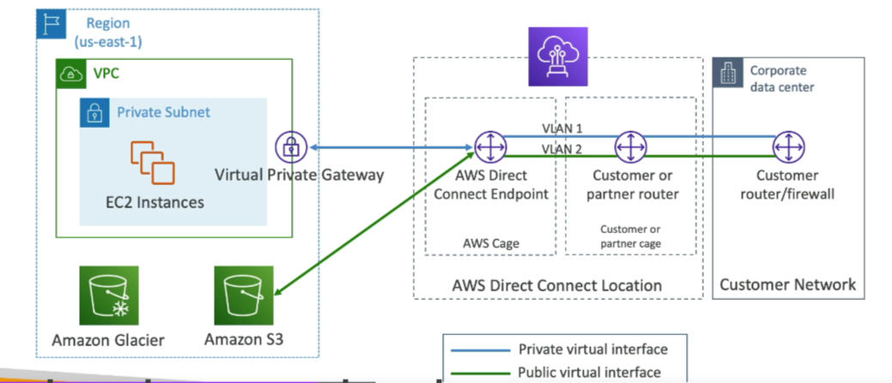
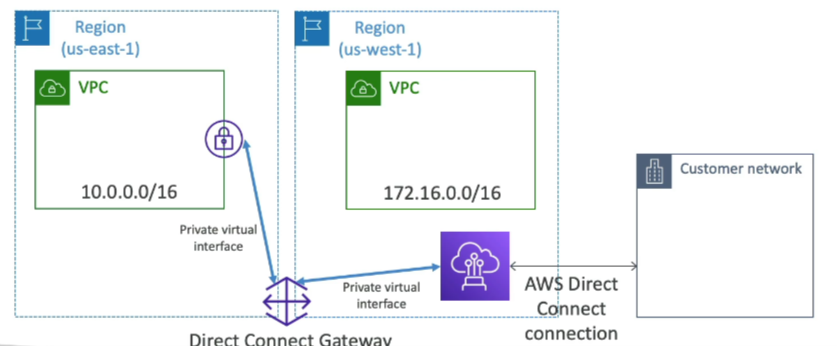
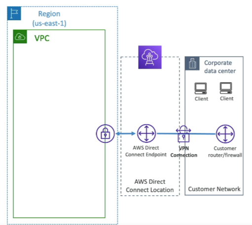
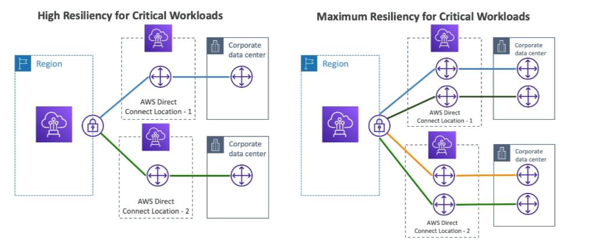
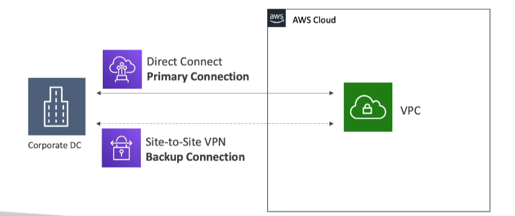

# Direct Connect (DX)

- **Purpose**: Provides a dedicated private connection from a remote network to your VPC.
- **Setup**:
    - Dedicated connection must be set up between your Data Center (DC) and AWS Direct Connect locations.
    - Need to set up a Virtual Private Gateway on your VPC.
- **Access**: Access public resources (S3) and private EC2 on the same connection.

## Use Cases

- **Increased Bandwidth Throughput**: Working with large data sets, lower cost.
- **Consistent Network Experience**: Applications using real-time data feeds.
- **Hybrid Environments**: On-premises + cloud.

## Direct Connect Gateway

- **Purpose**: If you want to set up a Direct Connect to one or more VPCs in many different regions (same account), you must use a Direct Connect Gateway.

## Connection Types

- **Dedicated Connections**:
    - Capacities: 1Gbps, 10Gbps, and 100Gbps.
    - Physical ethernet port dedicated to a customer.
    - Request made to AWS first, then completed by AWS Direct Connect Partners.
- **Hosted Connections**:
    - Capacities: 50Mbps, 500Mbps, to 10Gbps.
    - Connection requests are made via AWS Direct Connect Partners.
    - Capacity can be added or removed on demand.
    - 1, 2, 5, 10Gbps available at select AWS Direct Connect Partners.
    - Lead times are often longer than 1 month to establish a new connection.

## Encryption

- **Data in Transit**: Not encrypted but is private.
- **AWS Direct Connect + VPN**: Provides an IPsec-encrypted private connection.
    - Good for an extra level of security, but slightly more complex to put in place.

## Resiliency

- **High Resiliency for Critical Workloads**: One connection at multiple locations.
- **Maximum Resiliency for Critical Workloads**: Achieved by separate connections terminating on separate devices in more than one location.

## Site to Site VPN connection as a backup
In case Direct Connect fails, can set up a backup Direct Connect connection (expensive), or a Site to Site VPN connection

