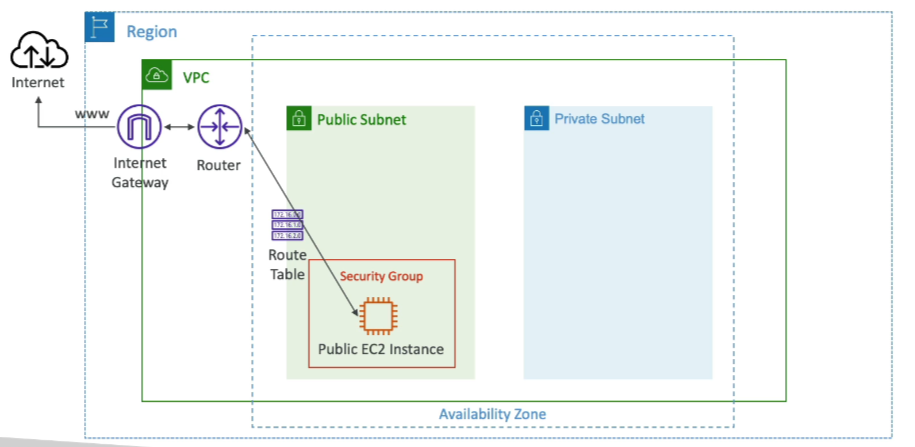

# Internet Gateway (IGW)

**Allows resources (e.g., EC2 instances) in a VPC to connect to the Internet.**

- **Scales Horizontally**: Highly available and redundant.
- **Separate Creation**: Must be created separately from VPC.
- **One-to-One Attachment**: One VPC can only be attached to one IGW and vice versa.
- **Route Tables**: Internet Gateways on their own do not allow Internet access; route tables must also be edited.

