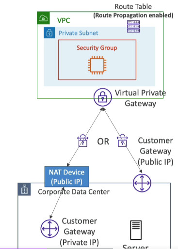

# Site to Site VPN Connections

## Customer Gateway Device (On-Premises)

- **IP Address**:
    - Use a public Internet-routable IP address for your Customer Gateway device.
    - If it's behind a NAT device that's enabled for NAT traversal (NAT-T), use the public IP address of the NAT device.
- **Route Propagation**: Enable Route Propagation for the Virtual Private Gateway in the route table that is associated with your subnets.
- **ICMP Protocol**: If you need to ping your EC2 instances from on-premises, make sure you add the ICMP protocol on the inbound of your security groups.

## AWS VPN CloudHub

- **Purpose**: Provides secure communication between multiple sites if you have multiple VPN connections.
- **Cost**: Low-cost hub-and-spoke model for primary or secondary network connectivity between different locations (VPN only).
- **Internet**: It's a VPN connection so it goes over the public Internet.
- **Setup**:
    - Connect multiple VPN connections on the same VGW.
    - Set up dynamic routing.
    - Configure route tables.

