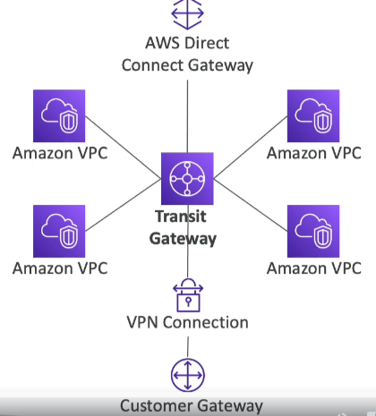

# Transit Gateway

- **Purpose**: For having transitive peering between thousands of VPCs and on-premises, hub-and-spoke (star) connection.
- **Regional Resource**: Can work cross-region.
- **Cross-Account Sharing**: Share cross-account using Resource Access Manager (RAM).
- **Cross-Region Peering**: You can peer Transit Gateways across regions.
- **Route Tables**: Limit which VPC can talk with other VPCs.
- **Compatibility**: Works with Direct Connect Gateway, VPN connections.
- **IP Multicast**: Supports IP Multicast (not supported by any other AWS service).

