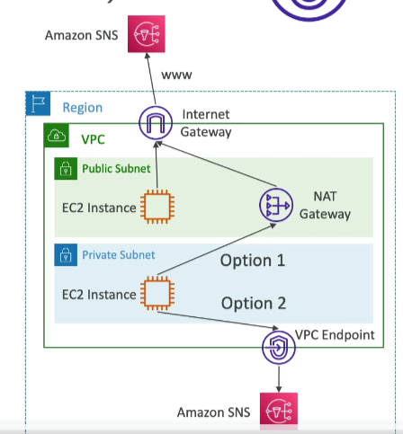

## AWS VPC Endpoints

### Overview
- Every AWS service is publicly exposed (public URL).
- VPC endpoints (powered by AWS PrivateLink) allow access without using the public Internet.
- They are redundant and scale horizontally.
- They remove the need for IGW, NATGW, etc., to access AWS services.

### Troubleshooting
- Check DNS Setting Resolution in your VPC.
- Check Route Tables.

### Types of Endpoints

#### Interface Endpoints (powered by PrivateLink)
- Provisions an ENI (private IP address) as an entry point (must attach a Security Group).
- Supports most AWS services.
- Cost: $ per hour + $ per GB of data processed.

#### Gateway Endpoints
- Provisions a gateway and must be used as a target in a route table (does not use security groups).
- Supports both S3 and DynamoDB.
- Cost: Free.
- Gateway is most likely going to be preferred all the time at the exam.

### Cost Comparison
- **Gateway Endpoints**: Free.
- **Interface Endpoints**: $ per hour + $ per GB of data processed.

### Usage Preference
- **Interface Endpoint**: Preferred if access is required from on-premises (Site to Site VPN or Direct Connect), a different VPC, or a different region.

