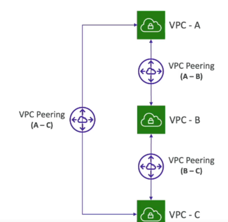

# VPC Peering

- **Purpose**: Privately connect two VPCs using AWS network.
- **Behavior**: Make them behave as if they were in the same network.
- **CIDR Requirements**: Must not have overlapping CIDRs.
- **Transitivity**: VPC Peering connection is NOT transitive (must be established for each VPC that needs to communicate with one another).
- **Route Tables**: Must update route tables in each VPC's subnets to ensure EC2 instances can communicate with each other.
- **Cross-Account/Region**: Can create VPC peering connection between VPCs in different AWS accounts/regions.
- **Security Groups**: Can reference a security group in a peered VPC (works cross accounts - same region).

