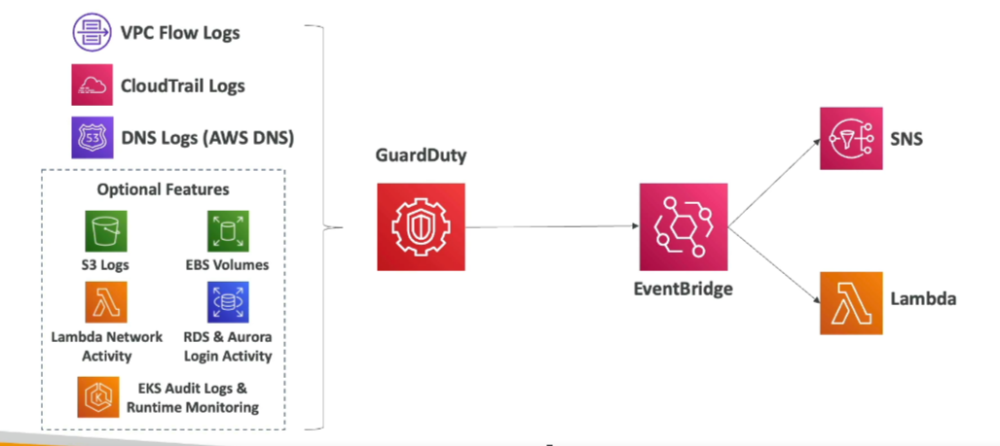

# Amazon GuardDuty

**Intelligent Threat Discovery to Protect Your AWS Account**

- **Uses Machine Learning Algorithms, Anomaly Detection, 3rd Party Data**
- **One Click to Enable**: 30 days trial, no need to install software

## Input Data Includes:

- **CloudTrail Event Logs**: Unusual API calls, unauthorized deployments
- **CloudTrail Management Events**: Create VPC subnet, create trail, etc.
- **CloudTrail S3 Data Events**: Get object, list objects, delete object, etc.
- **VPC Flow Logs**: Unusual internal traffic, unusual IP address
- **DNS Logs**: Compromised EC2 instances sending encoded data within DNS queries

## Optional Features

- **EKS Audit Logs**
- **RDS & Aurora**
- **EBS**
- **Lambda**
- **S3 Data Events**

## Notifications

- **EventBridge Rules**: Can set up EventBridge rules to be notified in case of findings
- **EventBridge Targets**: EventBridge rules can target AWS Lambda or SNS

## Protection Against CryptoCurrency Attacks

- **Dedicated Finding**: Has a dedicated "finding" for it

