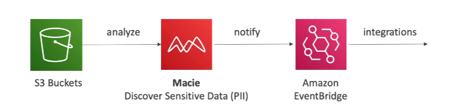

# Macie

**Macie is a fully managed data security and data privacy service that uses machine learning and pattern matching to discover and protect your sensitive data in AWS.**

- **Identify and Alert**: Macie helps identify and alert to sensitive data such as personally identifiable information (PII).

