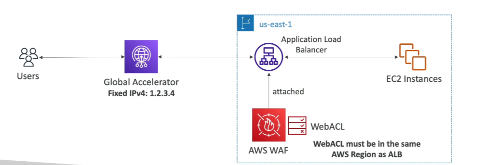

# AWS Web Application Firewall (WAF)

## Overview

- **Protection**: Protects your web applications from common web exploits (Layer 7).
- **Layer 7**: HTTP (vs Layer 4 is TCP/UDP).

## Deployment

- **Application Load Balancer**
- **API Gateway**
- **CloudFront**
- **AppSync GraphQL API**
- **Cognito User Pool**

## Web ACL (Web Access Control Lists)

- **IP Set**: Up to 10,000 IP addresses (use multiple Rules for more IPs).
- **HTTP Headers, HTTP Body, or URI Strings**: Protects from common attacks like SQL injection and Cross-site scripting (XSS).
- **Size Constraints, Geo-Match**: Block countries.
- **Rate-Based Rules**: Count occurrences of events (for DDoS protection).

## Regional vs Global

- **Web ACL**: Regional except for CloudFront.
- **Rule Group**: A reusable set of rules that you can add to a web ACL.

## Fixed IP with Load Balancer

- **Network Load Balancer**: WAF does not support the network load balancer (Layer 4).
- **Global Accelerator**: Use for fixed IP and WAF on the ALB.

